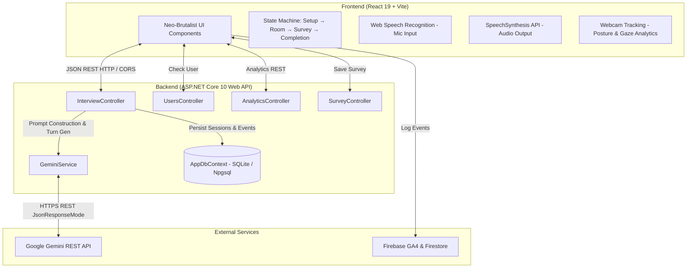
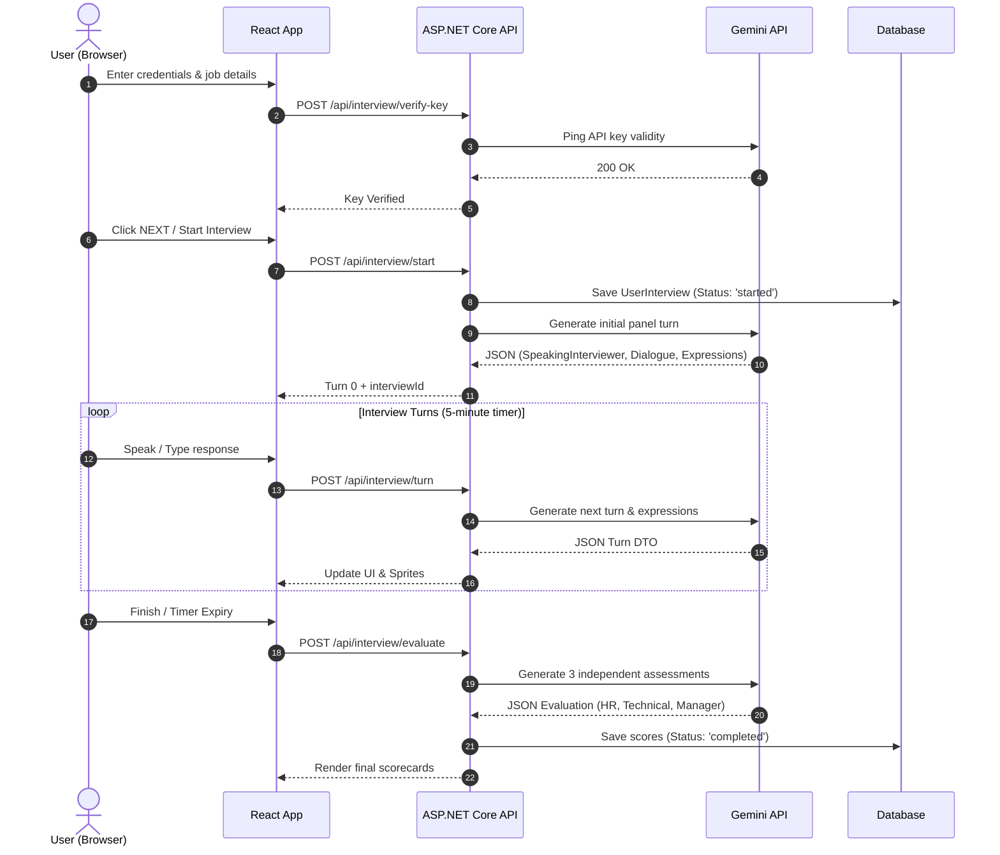

# 🏗️ TRIVE System Architecture

This document provides a comprehensive overview of the **TRIVE** system architecture, component breakdown, data flow, and underlying engineering design principles.

Related: [[Index]] | [[AI-Interviewer-Engine]] | [[Frontend-Architecture]] | [[Backend-Architecture]] | [[Database-Schema]]

---

## 📐 System Overview Diagram

---

## 🎯 Design Philosophy & Key Architectural Decisions

### 1. Multi-Agent Panel Simulation vs. Single Chatbot
**Why?** Traditional mock interview tools simulate a single generic AI interlocutor. Real industry interviews (especially senior, technical, or FAANG/MNC roles) involve a **panel of interviewers** with competing priorities:
- **HR**: Looks for culture fit, teamwork, and communication.
- **Technical**: Looks for algorithmic depth, edge cases, and architectural trade-offs.
- **Hiring Manager**: Looks for ownership, pragmatic decision-making, and execution velocity.

TRIVE's engine prompts Gemini to orchestrate a 3-way conversation, dynamically picking who speaks next based on candidate answers and updating avatar facial expressions for all 3 members simultaneously.

### 2. Client-Provided Gemini API Key Model
**Why?** LLM inference costs scale with usage. TRIVE passes the user's Gemini API key via custom HTTP headers (`X-Gemini-API-Key`) on a per-request basis. 
- **Security**: The backend **never** saves or logs API keys to disk or database tables. Keys exist only in memory during the request lifecycle.
- **Cost**: Users leverage their free tier or personal Google AI Studio quotas.

### 3. Dual Database Engine Strategy (SQLite + PostgreSQL)
**Why?** Development requires zero setup overhead, whereas deployment requires scalable database hosting.
- In `Program.cs`, EF Core checks the `UsePostgres` configuration flag:
  - Default: Single-file SQLite DB (`trive.db`) created automatically via `EnsureCreated()`.
  - Production: Switched to PostgreSQL via Npgsql with connection string injection.

### 4. Dynamic Expression & Avatar System
**Why?** Human body language and facial reactions are critical in interviews. Each of the 3 panel members has 6 discrete expression states mapped to PNG pixel art sprites. The AI evaluates candidate responses and updates sprite states per turn (e.g. Technical changes to `investigating` while HR changes to `happy`).

---

## 🔄 Lifecycle of an Interview Session

---

## 🔗 Related Notes

- [[Index]]
- [[AI-Interviewer-Engine]]
- [[Frontend-Architecture]]
- [[Backend-Architecture]]
- [[Database-Schema]]
- [[Behavioral-Analytics]]
- [[How-To-Setup-And-Run]]
