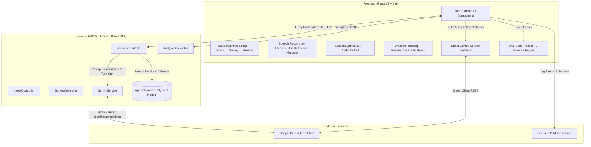
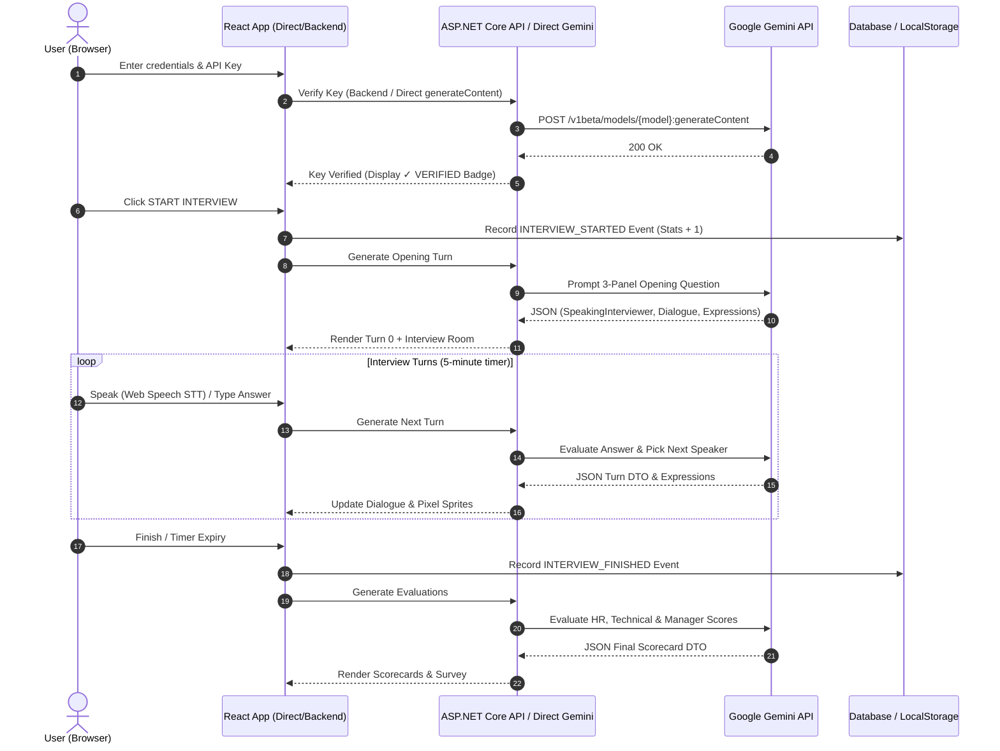

# 🏗️ TRIVE System Architecture

This document provides a comprehensive overview of the **TRIVE** system architecture, component breakdown, hybrid failover model, data flow, and underlying engineering design principles.

Related: [[Index]] | [[AI-Interviewer-Engine]] | [[Frontend-Architecture]] | [[Backend-Architecture]] | [[Database-Schema]] | [[Common-Mistakes]]

---

## 📐 System Overview Diagram

---

## 🎯 Design Philosophy & Key Architectural Decisions

### 1. Multi-Agent Panel Simulation vs. Single Chatbot
**Why?** Traditional mock interview tools simulate a single generic AI interlocutor. Real industry interviews (especially senior, technical, or FAANG/MNC roles) involve a **panel of interviewers** with competing priorities:
- **HR**: Looks for culture fit, teamwork, and communication.
- **Technical**: Looks for algorithmic depth, edge cases, and architectural trade-offs.
- **Hiring Manager**: Looks for ownership, pragmatic decision-making, and execution velocity.

TRIVE's engine prompts Gemini to orchestrate a 3-way conversation, dynamically picking who speaks next based on candidate answers and updating avatar facial expressions for all 3 members simultaneously.

### 2. Hybrid Failover Architecture (Backend + Direct Client Mode)
**Why?** Deploying full-stack applications often involves unhosted backends when frontends are deployed to static platforms like Vercel, Netlify, or GitHub Pages.
- **Primary Path**: TRIVE attempts to route requests through the C# ASP.NET Core backend API (`API_BASE_URL`).
- **Automatic Fallback**: If the backend is offline or unhosted, the frontend transparently switches to `directGeminiService.js`, issuing secure POST requests directly from the browser to Google Gemini API (`generativelanguage.googleapis.com`).
- **Result**: Zero-downtime serverless hosting capability anywhere online.

### 3. Client-Provided Gemini API Key Model
**Why?** LLM inference costs scale with usage. TRIVE passes the user's Gemini API key on a per-request basis.
- **Security**: Neither backend nor frontend stores user API keys to disk. Keys exist only in transient React memory.
- **Cost**: Users leverage their free tier or personal Google AI Studio quotas.

### 4. Zero-Baseline Live Community Metrics Engine
**Why?** Hardcoded platform statistics (e.g. 128 interviews, 75 price) confuse users and obscure real usage.
- TRIVE utilizes `statsService.js` to track live `SITE_VISIT`, `INTERVIEW_STARTED`, `INTERVIEW_FINISHED`, and `SURVEY_SUBMITTED` events in `localStorage` and sync with backend/Firebase.
- Metrics start at a clean **0 baseline** and calculate live percentages and prices dynamically.

### 5. Robust Speech Recognition Lifecycle Management
**Why?** Calling `.start()` on a stopped `SpeechRecognition` object in Chromium browsers causes an internal `InvalidStateError`, leading to frozen voice input with a blinking red recording dot.
- TRIVE's lifecycle manager instantiates a **fresh `SpeechRecognition` instance** upon every start/resume and issues explicit `getUserMedia({ audio: true })` checks to unlock hardware audio streams safely.

---

## 🔄 Lifecycle of an Interview Session

---

## 🔗 Related Notes

- [[Index]]
- [[AI-Interviewer-Engine]]
- [[Frontend-Architecture]]
- [[Backend-Architecture]]
- [[Database-Schema]]
- [[Behavioral-Analytics]]
- [[How-To-Setup-And-Run]]
- [[Common-Mistakes]]
