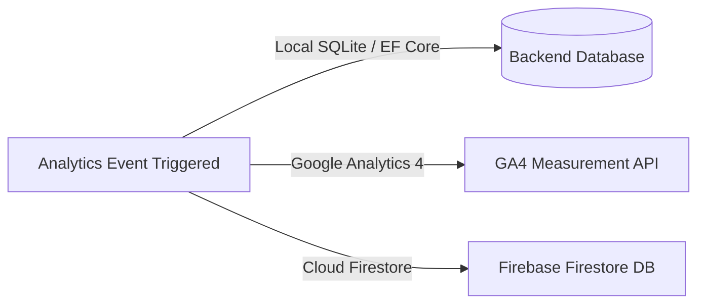

# 👁️ Behavioral Analytics & Real-Time Webcam Tracking

This document details TRIVE's real-time candidate behavioral analysis system embedded in `InterviewRoom.jsx`, covering posture tracking, gaze direction, filler word counting, thinking latency, and Firebase integration.

Related: [[Index]] | [[Architecture]] | [[Frontend-Architecture]]

---

## 🎯 Overview of Behavioral Metrics

During the interview, TRIVE continuously monitors candidate body language, voice pacing, and gaze alignment:

```
  ┌──────────────────────┐   ┌──────────────────────┐   ┌──────────────────────┐
  │   Posture Tracking   │   │    Gaze Alignment    │   │  Filler Words Count  │
  │ Detects slouching &  │   │  Detects looking off │   │ Detects 'um', 'like',│
  │ head tilt/distance   │   │  screen left/right   │   │ 'basically', etc.    │
  └──────────────────────┘   └──────────────────────┘   └──────────────────────┘
```

---

## 📷 Webcam Posture & Gaze Detection (`InterviewRoom.jsx`)

The frontend accesses candidate media streams using `navigator.mediaDevices.getUserMedia({ video: true })` and renders a floating, draggable canvas feed.

### 1. Calibration & Baseline
- Upon enabling webcam, the app collects initial frame samples (`isCalibratingRef`) to establish a **neutral baseline posture**.
- Calibrated ratios analyze bounding symmetry and face centroid coordinates.

### 2. Real-Time Vision Loop
A background animation/timer frame captures canvas video frames every few milliseconds:
- **Gaze Status States**:
  - `Centered`: Candidate is looking directly into camera.
  - `Far Left`: Candidate is looking off-screen left (eye wandering).
  - `Far Right`: Candidate is looking off-screen right.
  - `Far Up`: Candidate is looking up at ceiling/notes.
- **Posture Status**:
  - `Centered`: Professional upright posture.
  - `Slouching`: Centroid dropped below baseline threshold.

---

## 🗣️ Filler Word & Thinking Time Detector

### 1. Filler Word Counter
During Speech Recognition (STT) or keyboard input text parsing, the system regex matches common spoken filler words:
- Target phrases: `um`, `uh`, `like`, `you know`, `basically`, `actually`, `honestly`, `literally`, `i mean`, `right`.
- Increments `fillerWordCount` and updates the filler words breakdown array displayed on the post-interview scorecard.

### 2. Thinking Time Tracker
- When an interviewer finishes speaking, `turnStartTime` records `Date.now()`.
- When the candidate submits their answer, `(Date.now() - turnStartTime) / 1000` calculates candidate thinking latency.
- Accumulated into `totalThinkingSeconds` and averaged across turn counts.

---

## ☁️ Dual Analytics Logging (Local + Firebase)

TRIVE uses a dual-logging architecture for platform analytics (`config/firebase.js`):



1. **Local SQLite**: Logs event records (`SITE_VISIT`, `INTERVIEW_STARTED`, `INTERVIEW_COMPLETED`) to `AnalyticsEvent` DB table.
2. **Google Analytics 4**: Calls `logAnalyticsEvent(eventName, params)` using Firebase JS SDK.
3. **Firebase Firestore**: Calls `saveAnalyticsEventToFirestore()` storing event documents in Cloud Firestore for cross-session dashboards.

---

## 🔗 Related Notes

- [[Index]]
- [[Architecture]]
- [[Frontend-Architecture]]
- [[Backend-Architecture]]
