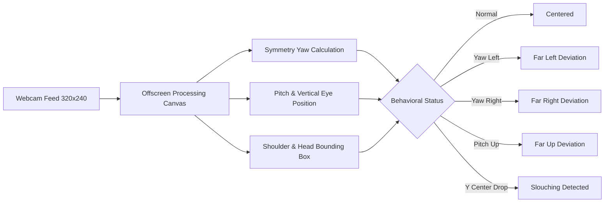

# 👁️ Behavioral Analytics & Vision Tracking Engine

This document details the real-time behavioral computer vision tracking, filler word detection, thinking time analysis, and zero-baseline community metrics in **TRIVE**.

Related: [[Index]] | [[Architecture]] | [[Frontend-Architecture]] | [[Common-Mistakes]]

---

## 📹 Real-Time Vision Tracking Engine (`InterviewRoom.jsx`)

TRIVE accesses candidate webcam video streams using `navigator.mediaDevices.getUserMedia({ video: { width: 320, height: 240 } })` and renders a floating, draggable canvas feed.

### Metrics Tracked:
1. **Gaze Deviations**: Counts occurrences where the candidate's eyes wander away from the center interviewer panel (`Far Left`, `Far Right`, `Far Up`).
2. **Posture Violations**: Detects slouching or dropping below baseline vertical alignment.
3. **Filler Word Count**: Real-time natural language token scanning for filler words (`um`, `uh`, `like`, `you know`, `basically`, `actually`).
4. **Thinking Time**: Measures candidate turn latency (seconds spent thinking before submitting an answer).

---

## 📊 Live Community Metrics System (`statsService.js`)

TRIVE maintains real-time community statistics across all sessions:

| Metric | Calculation | Baseline |
| :--- | :--- | :--- |
| **Site Visits** | Total unique page views (`SITE_VISIT`) | `0` |
| **Interview Started** | Total interview sessions launched (`INTERVIEW_STARTED`) | `0` |
| **Interview Finished** | Total interview sessions completed (`INTERVIEW_FINISHED`) | `0` |
| **Would Use Again** | $\frac{\text{wouldUseAgainCount}}{\text{totalSurveys}} \times 100$ | `0%` |
| **Avg Price Willing to Pay** | $\frac{\text{totalPriceSum}}{\text{totalSurveys}}$ | `₹0` |
| **Would Refer to Friend** | $\frac{\text{wouldReferCount}}{\text{totalSurveys}} \times 100$ | `0%` |

---

## 🔗 Related Notes

- [[Index]]
- [[Architecture]]
- [[Frontend-Architecture]]
- [[How-To-Setup-And-Run]]
- [[Common-Mistakes]]
