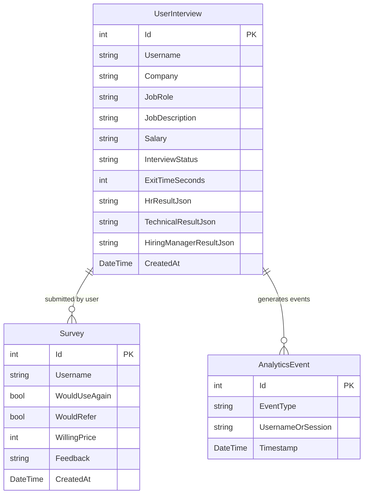

# 💾 Database Schema & Entity Framework Data Models

This document details the database architecture, Entity Framework Core models, table definitions, and dual-database configuration (SQLite & PostgreSQL).

Related: [[Index]] | [[Architecture]] | [[Backend-Architecture]]

---

## 🗄️ Database Strategy & Provider Switching

TRIVE uses **Entity Framework Core 10** configured in `Program.cs` to support both zero-configuration local development and scalable PostgreSQL production deployments:

```csharp
var usePostgres = builder.Configuration.GetValue<bool>("UsePostgres");
var pgConnStr = builder.Configuration.GetConnectionString("PostgreSQL");

if (usePostgres && !string.IsNullOrEmpty(pgConnStr))
{
    builder.Services.AddDbContext<AppDbContext>(options =>
        options.UseNpgsql(pgConnStr));
}
else
{
    var baseDir = AppDomain.CurrentDomain.BaseDirectory;
    var dbPath = System.IO.Path.Combine(baseDir, "trive.db");
    var sqliteConnStr = builder.Configuration.GetConnectionString("SQLite") ?? $"Data Source={dbPath}";
    builder.Services.AddDbContext<AppDbContext>(options =>
        options.UseSqlite(sqliteConnStr));
}
```

- **SQLite**: Stores data locally in `backend/trive.db` or output directory. Created automatically on startup via `db.Database.EnsureCreated()`.
- **PostgreSQL**: Enabled by setting `"UsePostgres": true` in `appsettings.json` and providing a PostgreSQL connection string.

---

## 📋 Entity Models & Table Specifications



---

### 1. `UserInterview` Table

Stores candidate interview session setup, status, exit duration, and JSON scorecard evaluation results.

| Property | Type | Nullable | Description |
| :--- | :--- | :--- | :--- |
| `Id` | `int` | No (PK) | Primary Key (Auto-increment ID). |
| `Username` | `string` | No | Unique candidate username (50 max chars). |
| `Company` | `string` | No | Target company name (e.g. Accenture, Google). |
| `JobRole` | `string` | No | Target role title (e.g. Software Engineer Intern). |
| `JobDescription` | `string` | No | Full job description text (3000 max chars). |
| `Salary` | `string` | Yes | Target salary string (e.g. `₹8,00,000 / year`). |
| `InterviewStatus` | `string` | No | Session lifecycle: `'started'`, `'completed'`, `'abandoned'`. |
| `ExitTimeSeconds` | `int?` | Yes | Time elapsed when session finished or abandoned. |
| `HrResultJson` | `string?` | Yes | Serialized JSON results from HR assessment. |
| `TechnicalResultJson` | `string?` | Yes | Serialized JSON results from Technical assessment. |
| `HiringManagerResultJson` | `string?` | Yes | Serialized JSON results from Hiring Manager assessment. |
| `CreatedAt` | `DateTime` | No | UTC timestamp when session was created. |

---

### 2. `AnalyticsEvent` Table

Tracks user platform interactions for real-time usage analytics.

| Property | Type | Nullable | Description |
| :--- | :--- | :--- | :--- |
| `Id` | `int` | No (PK) | Primary Key (Auto-increment ID). |
| `EventType` | `string` | No | Action type: `'SITE_VISIT'`, `'INTERVIEW_STARTED'`, `'INTERVIEW_COMPLETED'`, `'INTERVIEW_ABANDONED'`. |
| `UsernameOrSession` | `string` | No | Username or generated session identifier. |
| `Timestamp` | `DateTime` | No | UTC timestamp of event. |

---

### 3. `Survey` Table

Stores post-interview candidate survey responses.

| Property | Type | Nullable | Description |
| :--- | :--- | :--- | :--- |
| `Id` | `int` | No (PK) | Primary Key (Auto-increment ID). |
| `Username` | `string` | No | Candidate username. |
| `WouldUseAgain` | `bool` | No | Survey answer: Would candidate use platform again? |
| `WouldRefer` | `bool` | No | Survey answer: Would candidate refer friends? |
| `WillingPrice` | `int` | No | Suggested pricing value in INR (₹). |
| `Feedback` | `string?` | Yes | Qualitative user feedback text. |
| `CreatedAt` | `DateTime` | No | UTC timestamp of submission. |

---

## 🔗 Related Notes

- [[Index]]
- [[Architecture]]
- [[Backend-Architecture]]
