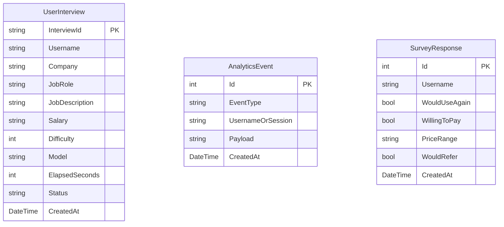

# 🗄️ TRIVE Database Schema & Persistence

This document details the Entity Framework Core database models, tables, relationships, and dual SQLite / PostgreSQL driver configuration.

Related: [[Index]] | [[Architecture]] | [[Backend-Architecture]] | [[Common-Mistakes]]

---

## 📊 Entity Relationship Diagram

---

## 🔒 Git & Security Exclusions

SQLite journal and WAL files (`trive.db-shm`, `trive.db-wal`, `trive.db`) are excluded from Git repository tracking via `.gitignore` to prevent database lock issues during concurrent commits.

---

## 🔗 Related Notes

- [[Index]]
- [[Architecture]]
- [[Backend-Architecture]]
- [[How-To-Setup-And-Run]]
- [[Common-Mistakes]]
