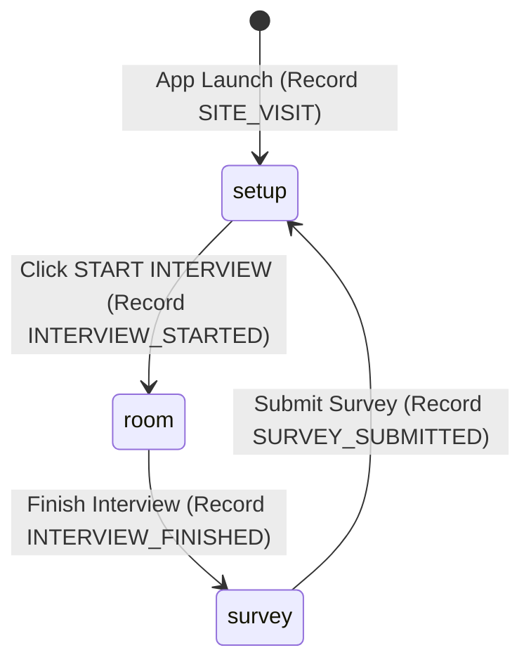

# 🎨 TRIVE Frontend Architecture

This document details the frontend engineering design of **TRIVE**, built with **React 19**, **Vite**, **Tailwind CSS v4** (Neo-Brutalist design language), Web Speech API, and a serverless Direct Gemini client fallback module.

Related: [[Index]] | [[Architecture]] | [[AI-Interviewer-Engine]] | [[Behavioral-Analytics]] | [[Common-Mistakes]]

---

## 🧩 Component & Directory Hierarchy

```
frontend/
├── public/
│   └── assets/
│       └── avatars/             # Pixel art sprite layers (HR, Technical, Manager)
├── src/
│   ├── assets/                  # SVG logos and static media
│   ├── components/
│   │   ├── InterviewDetails.jsx # Setup form, model selection, live stats, key verification
│   │   ├── InterviewRoom.jsx    # Core interview UI, dialogue box, webcam, sprites, mic controls
│   │   ├── SpriteDisplay.jsx    # Expression sprite renderer per interviewer
│   │   └── Survey.jsx           # End-of-session feedback survey
│   ├── config/
│   │   ├── api.js               # Dynamic API base URL resolver
│   │   └── firebase.js          # GA4 analytics & Firestore event persistence
│   ├── services/
│   │   ├── directGeminiService.js # Serverless direct Google Gemini REST API client
│   │   └── statsService.js      # Zero-baseline live community statistics tracker
│   ├── App.jsx                  # Navigation state machine & error boundaries
│   └── main.jsx                 # React root entry point
└── package.json
```

---

## 🕹️ Application State Machine

The top-level `App.jsx` component manages app navigation through four primary states:



1. **`setup` (`InterviewDetails.jsx`)**: Candidate inputs credentials, selects Gemini model, enters API Key (displays `✓ VERIFIED` badge), configures input mode (Mic / Keyboard), and reviews live metrics.
2. **`room` (`InterviewRoom.jsx`)**: The 5-minute panel interview room. Handles Web Speech STT, Speech Synthesis TTS, webcam posture/gaze analytics, filler word count, turn submissions, and sprite animations.
3. **`survey` (`Survey.jsx`)**: 4-question feedback survey recording satisfaction, willing price, and referral metrics.
4. **`results`**: Displays detailed HR, Technical, and Hiring Manager scorecards with 0-100 metric gauges.

---

## ⚡ Direct Gemini Fallback Service (`directGeminiService.js`)

To support serverless online deployments (Vercel, Netlify, GitHub Pages) without an active ASP.NET Core backend server, `directGeminiService.js` provides direct browser-to-Google Gemini API communication:

- **`verifyKeyDirectly(apiKey, model)`**: Issues a lightweight test request (`POST https://generativelanguage.googleapis.com/v1beta/models/{model}:generateContent?key=...`). Bypasses browser CORS restrictions associated with GET `/v1beta/models`.
- **`startInterviewDirectly(config)`**: Generates opening panel introduction and initial question directly from the browser.
- **`generateTurnDirectly(params)`**: Evaluates candidate answers and generates turn responses, speaker selections, and expression states.
- **`generateEvaluationsDirectly(params)`**: Generates final HR, Technical, and Hiring Manager scorecards upon completion.

---

## 🎙️ Speech Recognition Lifecycle (`InterviewRoom.jsx`)

Web Speech API implementations in Chromium browsers stall when `.start()` is called on an already stopped `SpeechRecognition` instance (`InvalidStateError`). 

TRIVE solves this with a **Fresh Instance Lifecycle Manager**:
- **`startSpeechRecognition()`**:
  1. Cleans up and unbinds handlers on existing instances.
  2. Prompts explicit hardware mic permission via `navigator.mediaDevices.getUserMedia({ audio: true })`.
  3. Instantiates a `new SpeechRecognition()` object.
  4. Configures `continuous = true` and `interimResults = true`.
  5. Automatically re-instantiates fresh instances on `onend` to maintain seamless voice input across speech pauses.
- **`stopSpeechRecognition()`**: Safely unbinds `onend` and `onerror` handlers before invoking `.stop()`.

---

## 📊 Live Community Metrics Engine (`statsService.js`)

TRIVE enforces a strict **0-baseline policy** (no hardcoded metrics like 128, 75, or 100%):
- Metrics (`siteVisits`, `startedCount`, `finishedCount`, `totalSurveys`, `wouldUseAgainCount`, `wouldReferCount`, `avgPrice`) start at `0`.
- Recorded live in browser `localStorage` (`trive_live_stats`) and synced with backend API / Firebase Firestore.
- Percentages and averages are calculated dynamically from actual user interactions:
  $$\text{Would Use Again \%} = \frac{\text{wouldUseAgainCount}}{\text{totalSurveys}} \times 100$$
  $$\text{Avg Price} = \frac{\text{totalPriceSum}}{\text{totalSurveys}}$$

---

## 🎨 Neo-Brutalist UI Palette

TRIVE uses a distinctive high-contrast retro Neo-Brutalist design language:
- **Background Yellow**: `#ffcc00`
- **Light Blue**: `#93c5fd`
- **Light Green**: `#86efac`
- **Purple Accent**: `#8b5cf6`
- **Terminal Black**: `#000000`
- **Borders**: 2px - 3px solid `#000000` with zero border radius.

---

## 🔗 Related Notes

- [[Index]]
- [[Architecture]]
- [[AI-Interviewer-Engine]]
- [[Behavioral-Analytics]]
- [[How-To-Setup-And-Run]]
- [[Common-Mistakes]]
