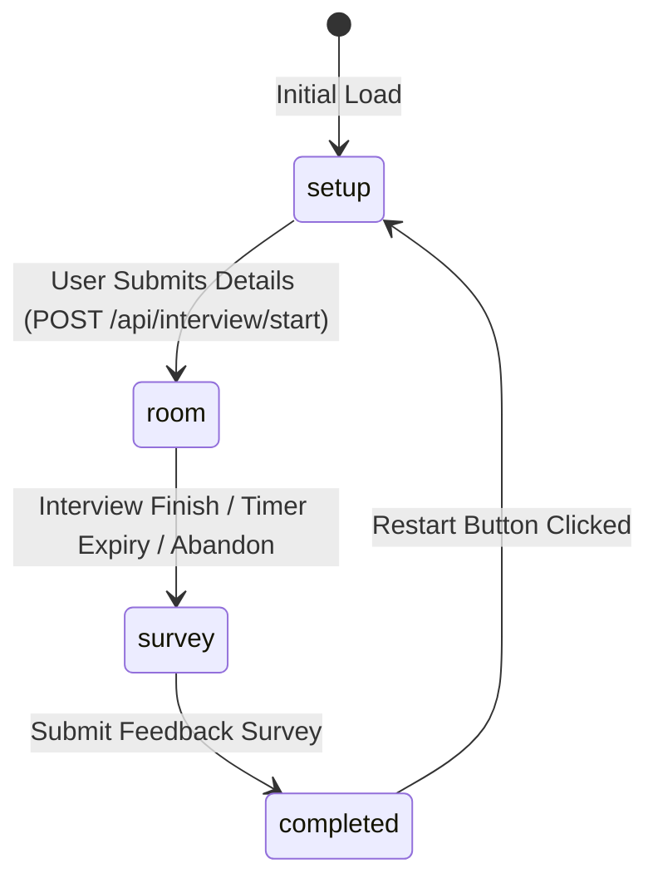

# 🎨 Frontend Architecture & Neo-Brutalist UI System

This document describes the React frontend architecture, component layout, state machine, and the **Neo-Brutalist retro design system** used in TRIVE.

Related: [[Index]] | [[Architecture]] | [[AI-Interviewer-Engine]] | [[Behavioral-Analytics]]

---

## 🔄 App State Machine (`App.jsx`)

TRIVE's user flow is driven by a clean 4-stage state machine:



| Step | Component | Responsibilities |
| :--- | :--- | :--- |
| `setup` | `InterviewDetails.jsx` | Configures username, role, salary, difficulty, Gemini API key, displays pixel sprites & live stats. |
| `room` | `InterviewRoom.jsx` | Conducts interactive interview, webcam tracking, audio TTS/STT, panel dialogue, timer, and scorecards. |
| `survey` | `Survey.jsx` | Collects post-interview user feedback (pricing, recommendations, rating). |
| `completed` | `Completion.jsx` | Final completion screen with restart capability. |

---

## 🎨 Neo-Brutalist Visual Design System

TRIVE adheres to a distinct **Retro Neo-Brutalist Aesthetic** characterized by high contrast, solid black borders, uppercase typography, and vibrant block colors.

### Signature Color Palette

```
  ┌─────────────┐  ┌─────────────┐  ┌─────────────┐  ┌─────────────┐  ┌─────────────┐
  │  #8b5cf6    │  │  #ffcc00    │  │  #86efac    │  │  #93c5fd    │  │  #ffffff    │
  │  Vibrant    │  │  Retro      │  │  Light      │  │  Light      │  │  Pure       │
  │  Purple     │  │  Yellow     │  │  Green      │  │  Blue       │  │  White      │
  └─────────────┘  └─────────────┘  └─────────────┘  └─────────────┘  └─────────────┘
```

| Color Hex | Name | Primary Application |
| :--- | :--- | :--- |
| `#8b5cf6` | Vibrant Purple | Header banner, HR badge, NEXT primary action button, high-priority stats |
| `#ffcc00` | Retro Yellow | Title subtitles, model selects, API key inputs, Manager badge, started metrics |
| `#86efac` | Light Green | Left panel background (Green Region), finished stats, verified badges |
| `#93c5fd` | Light Blue | Right panel background (Blue Region), Technical badge, keyboard mode toggle |
| `#ffffff` | Pure White | Input boxes, textareas, sprite card containers |
| `#000000` | Jet Black | Section headers (`bg-[#000000] text-white`), thick borders (`border-3 border-black`) |

---

## 🖼️ Pixel Sprite System & Avatar Showcase

TRIVE features pixel art sprites for the 3 interviewers stored in `frontend/public/assets/avatars/`:
- `hr/` (`default.png`, `happy.png`, `thinking.png`, `very_pleased.png`, `awkward.png`, `disappointed.png`, `satisfied.png`)
- `technical/` (`default.png`, `impressed.png`, `skeptical.png`, `investigating.png`, `astonished.png`, `exhausted.png`, `thinking.png`)
- `hiring_manager/` (`default.png`, `considering.png`, `evaluating.png`, `impressed.png`, `questioning.png`, `respect.png`, `unimpressed.png`)

### Homepage Horizontal Showcase (`InterviewDetails.jsx`)
In the homepage **Green Region** (`#86efac`), cropped headshot photos of the 3 pixel avatars are displayed horizontally side-by-side:

```jsx
<div className="grid grid-cols-3 gap-2.5">
  <div className="bg-white border-3 border-black p-2 flex flex-col items-center">
    <div className="w-full h-24 bg-[#8b5cf6] border-2 border-black overflow-hidden relative">
      
    </div>
    <span className="font-mono font-extrabold text-xs text-black mt-1.5 uppercase">HR</span>
  </div>
  ...
</div>
```

---

## 🎙️ Speech Input (STT) & Voice Output (TTS)

- **Speech Recognition (STT)**: Built using the browser `webkitSpeechRecognition` API. Enabled when candidate toggles `MIC MODE`.
- **Speech Synthesis (TTS)**: Built using `window.speechSynthesis`. When `VOICE ON` is active, dialogue is read aloud using Web Speech voices.

---

## 🔗 Related Notes

- [[Index]]
- [[Architecture]]
- [[AI-Interviewer-Engine]]
- [[Behavioral-Analytics]]
